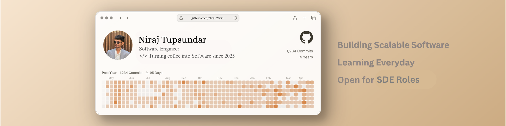

 
   

<h1 align="center">
  
</h1>

<h3 align="center">A Software Engineer from India</h3>

---

### 💼 Work Experience
- 🧠 **Backend Engineer at [Dezzex Technologies](https://www.dezzex.com/) September 2025 - Present**  
  Building scalable Django/Python backend systems for **AI-driven real-time analytics** and **performance-based video processing** deployed on AWS.  
  Involved in optimizing APIs, managing inference pipelines, and ensuring reliable cloud integrations.

- 💻 **Trainee Software Engineer at [Bosleo Technologies](https://www.bosleo.com/) January 2025 - August 2025**  
  Contributing to the frontend development of **Alex**, a healthcare-focused product, using **Angular** and **RxJS**.  
  Worked on crafting dynamic data-driven UI components, handling API integrations, and ensuring responsive, high-performance user experiences aligned with modern design principles.

---

### 🌱 Certifications & Cources
- Machine Learning & Data Science *(GeeksforGeeks)*
- MERN Stack Development *(CodeHelp)*
- Programming with JavaScript *(Coursera Meta)*
- 100 Days of Code – Python *(Udemy)*

---

### 👨‍💻 Projects
- **[EvolvX](https://industry-4-0-azure.vercel.app/)** – AI-driven Industry 4.0 Readiness System for sustainable growth.  
- **[Codex](https://codexhub.org.in/)** – MERN-based DSA contest and interview insights platform.  
- **Camex (Dezzex)** – AI-powered video analytics backend using Django & AWS.

---

### 🛠 Languages, Frameworks & Tools

  

---

### 📫 Connect With Me

  
  
  
  

---

### 🧩 Certifications

  
  
  
  

---

### ⚡ GitHub Stats

  

  

  

---

### 🏆 Achievements
- State Finalist – *DIPEX 2025*
- Google Cloud Arcade Facilitator Program
- Technical Lead – *Phoenix Club, K.K. Wagh*
- Solved 300+ Problems (LeetCode, CodeChef, GFG)

---

⭐ *“Passionate about building reliable and impactful software products.”*
